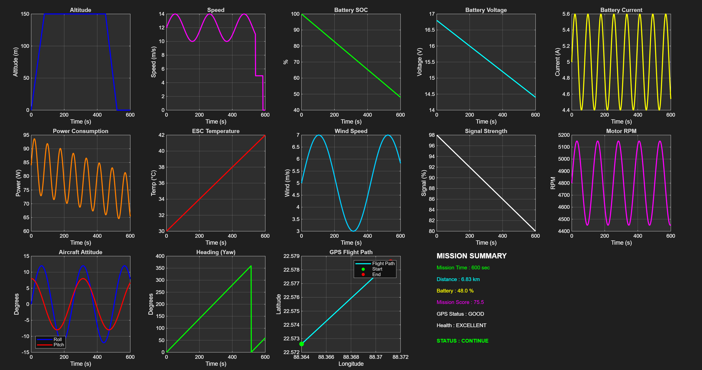

# 🚁 Intelligent UAV Ground Control Station

MATLAB-based Intelligent UAV Ground Control Station developed using **MATLAB App Designer** for real-time drone telemetry monitoring, battery management, GPS tracking, AI-based mission scoring, and automated report generation.

---

# 📌 Overview

This project simulates an intelligent Ground Control Station (GCS) for monitoring UAV missions. It provides an interactive dashboard for tracking important flight parameters, battery performance, and mission status while automatically generating mission reports.

The application demonstrates concepts of:

- UAV Telemetry
- Battery Management System (BMS)
- Data Visualization
- GPS Monitoring
- Engineering Dashboard Design
- Automated Report Generation

---

# ✨ Features

- 📡 Live UAV Telemetry Dashboard
- 🔋 Battery Voltage Monitoring
- ⚡ Current Monitoring
- 🌡 Temperature Monitoring
- 📊 State of Charge (SOC) Analysis
- 📍 GPS Tracking
- 🤖 AI-based Mission Scoring
- 🛬 Return-To-Home Logic
- 🚨 Emergency Landing Functionality
- 📄 Automatic Flight Report Generation

---

# 🖥 Dashboard Preview



---

# 📂 Repository Structure

```
Intelligent-UAV-Ground-Control-Station

│
├── Drone_Telemetry_V6
├── README.md
│
├── images
│   └── UAV_GCS_V6_Dashboard.png
│
└── reports
    ├── Flight_Report.csv
    └── Mission_Report.txt
```

---

# 🛠 Technologies Used

- MATLAB
- MATLAB App Designer
- Data Visualization
- Battery Management System (BMS)
- UAV Telemetry
- GPS Data Processing
- CSV Report Generation

---

# 📈 Parameters Monitored

- Battery Voltage
- Battery Current
- Battery Temperature
- State of Charge (SOC)
- GPS Coordinates
- Mission Status
- AI Mission Score

---

# 📄 Generated Reports

The application automatically creates:

- 📊 **[Flight_Report.csv](reports/Flight_Report.csv)** – Flight telemetry and mission data

- 📝 **[Mission_Report.txt](reports/Mission_Report.txt)** – Mission summary and status report

Both sample reports are available in the **`reports`** folder.
---

# 🚀 Applications

This project can be applied to:

- UAV Ground Control Stations
- Drone Fleet Monitoring
- Battery Management Systems
- Aerospace Monitoring
- Autonomous Vehicle Dashboards
- Engineering Simulation

---

# 🔮 Future Improvements

- Live Drone Communication
- MAVLink Integration
- ROS Integration
- Cloud-Based Telemetry
- Multi-UAV Monitoring
- Predictive Battery Health Analysis
- Real-Time Flight Path Visualization

---

# 👨‍💻 Author

Subhankar Saha

B.Tech – Electronics & Telecommunication Engineering

KIIT Deemed to be University

---

# 🧰 Skills Demonstrated

- MATLAB Programming
- MATLAB App Designer
- GUI Development
- Battery Management Systems
- Data Visualization
- Telemetry Processing
- Dashboard Development
- Engineering Simulation
- UAV System Design

---

# 📜 License

This project is released under the MIT License.

---

⭐ If you found this project interesting, feel free to star the repository.
